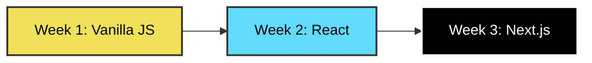
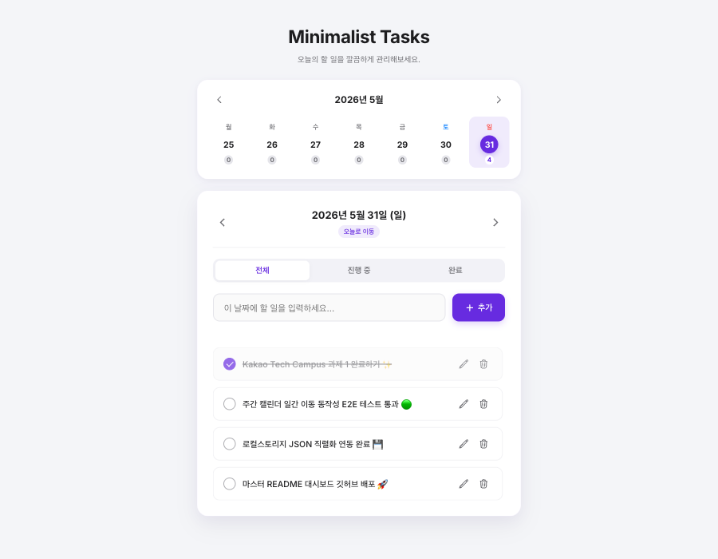
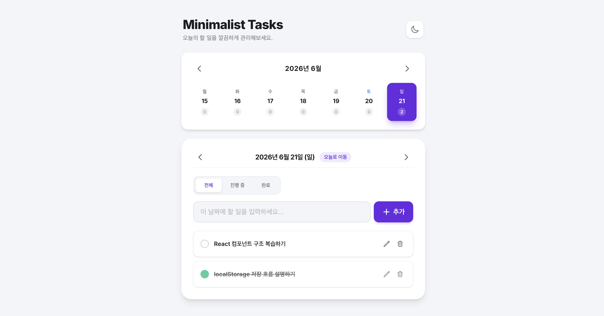
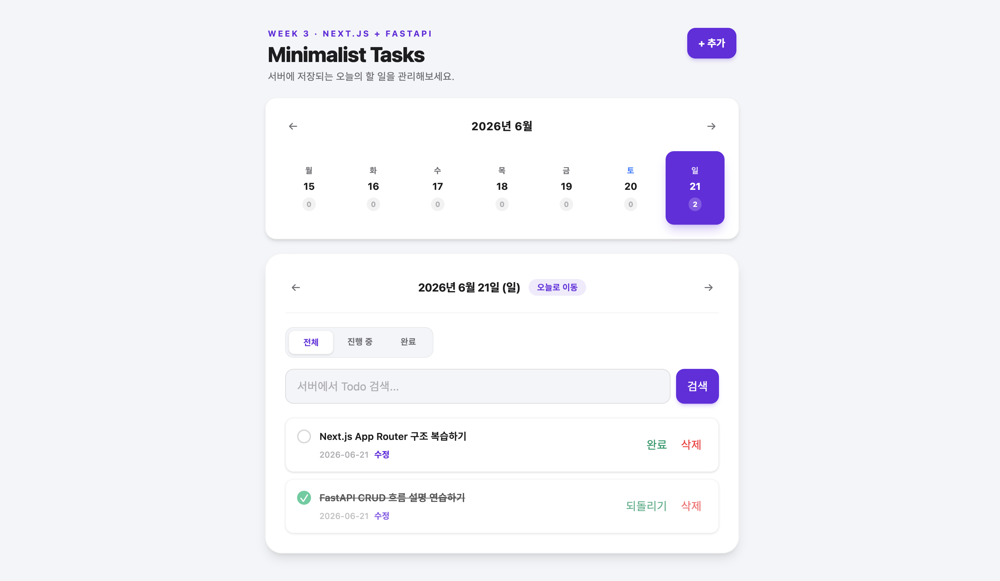

# ⚡ Kakao Tech Campus — Todo Web App Refactoring Journey

> **Vanilla JS ➔ React ➔ Next.js**로 점진적으로 고도화되는 3주간의 생산성 Todo 애플리케이션 개발 여정입니다.

---

## 📅 과제 대시보드 (Assignment Dashboard)

| 주차 | 주제 | 적용 기술 | 진행 상태 | 주요 링크 |
| :--- | :--- | :--- | :---: | :--- |
| **Week 1** | **Vanilla JS Todo** | HTML, CSS, JS, LocalStorage, Vite | 🟢 **완료** | [📁 코드 보기](./task1/) • [🌿 브랜치](https://github.com/softkleenex/kakao-assignment-1/tree/week-01-softkleenex) • [💬 제출 이슈](https://github.com/softkleenex/kakao-assignment-1/issues/1) |
| **Week 2** | **React Refactoring** | React, Vite, Tailwind CSS, LocalStorage | 🟢 **완료** | [📁 코드 보기](./task2/) |
| **Week 3** | **Next.js Fullstack** | Next.js, FastAPI, SQLite, API Route | 🟢 **구현 완료** | [📁 코드 보기](./task3/) • [📝 계획](./task3/PLAN.md) |

---

## 🎨 기술 스택의 진화 (Tech Stack Evolution)



---

## 📂 프로젝트 구조 (Project Folder Structure)

```markdown
kakao-assignment-1/
├── .gitignore               # 프로젝트 전역 Git 제외 파일 설정
├── AGENTS.md                # AI 협업 및 과제 작업 기준
├── README.md                # 전체 리포지토리 대시보드 (현재 파일)
├── task1/                   # [Week 1] Vanilla JS Todo 앱
├── task2/                   # [Week 2] React Todo 앱
└── task3/                   # [Week 3] Next.js + FastAPI Todo 앱
    ├── PLAN.md              # 3차 과제 구현 계획
    ├── TROUBLESHOOTING.md   # 구현 중 문제와 해결 기록
    ├── backend/             # FastAPI + SQLite
    └── frontend/            # Next.js App Router
```

---

## 🛠️ 실행 및 개발 방법 (Getting Started)

각 주차별 과제는 독립된 서브디렉토리로 구성되어 있습니다. 1차와 2차는 프론트엔드 중심이고, 3차는 `frontend/`와 `backend/`가 분리된 풀스택 구조입니다.

### 1. 저장소 클론 및 폴더 이동
```bash
git clone https://github.com/softkleenex/kakao-assignment-1.git
cd kakao-assignment-1/task3  # 실행하려는 주차 폴더로 이동
```

### 2. 패키지 설치 및 로컬 서버 실행

3차 과제는 프론트엔드와 백엔드를 각각 별도 터미널에서 실행합니다.
```bash
# 3차 프론트엔드
cd frontend
npm install
cp .env.example .env.local
npm run dev
```

```bash
# 3차 백엔드
cd ../backend
python3 -m venv .venv
source .venv/bin/activate
pip install -r requirements.txt
cp .env.example .env.local
uvicorn main:app --reload
```
3차 프론트엔드는 `http://localhost:3000/todos`, 백엔드는 `http://localhost:8000/docs`에서 확인할 수 있습니다.

---

## 💜 Developer Profile

- **Developer**: softkleenex (isangjae)
- **Goal**: 단순히 동작하는 코드를 넘어, 사용자 중심의 뛰어난 인터랙션과 유지보수가 용이한 아키텍처를 설계하는 프론트엔드 엔지니어로 성장하기

---

## 📷 주차별 과제 미리보기 (Weekly Previews)

### 🌿 Week 1: Vanilla JS Todo


---

### ⚛️ Week 2: React Refactoring
[코드 보기](./task2/)



---

### ⚡ Week 3: Next.js Fullstack
[코드 보기](./task3/) · [계획 문서](./task3/PLAN.md) · [트러블슈팅](./task3/TROUBLESHOOTING.md)


