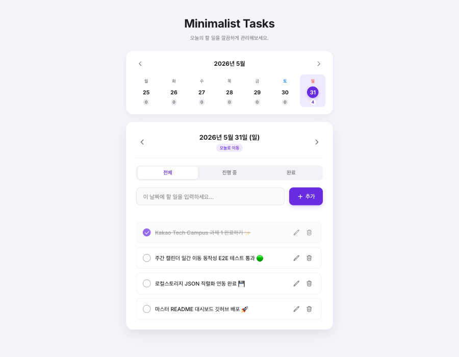

# 🌿 Week 1 — Vanilla JS Todo Web Application

> **Kakao Tech Campus 1단계 과제**로 Vanilla HTML, CSS, JS 및 Web Storage API를 활용하여 구축된 미니멀 생산성 Todo 애플리케이션입니다.

---

## 📷 서비스 화면 미리보기 (Preview)



---

## 🛠️ 핵심 구현 기능 (Key Features)

### 1. Todo CRUD (Create, Read, Update, Delete)
- **추가 및 검증**: 빈 입력값 차단 및 사용자 오류 안내 메시지 표시
- **수정 모드**: 텍스트 클릭/수정 버튼을 통한 즉각적 인풋 포커스 싱크 및 저장/취소
- **완료 처리**: 커스텀 체크박스를 통해 완료 여부 즉각 반영 및 세련된 취소선 처리
- **삭제**: 항목별 삭제 기능 제공

### 2. 상태별 필터링 (Status Filtering)
- **전체 / 진행 중 / 완료** 탭 제공
- 현재 활성화된 필터 조건에 부합하는 할 일만 필터링하여 노출 및 액티브 탭 하이라이트

### 3. 일간 날짜별 관리 (Daily View)
- 상단 일간 날짜 컨트롤러(이전 날짜, 다음 날짜, 오늘) 제공
- 날짜 변경 시 해당 날짜의 Todo 목록만 불러와 독립적으로 관리 및 저장

### 4. 로컬스토리지 연동 (Data Persistence)
- 모든 변경 사항(추가, 상태 전환, 수정, 삭제) 발생 시 `JSON.stringify`를 거쳐 `localStorage`에 즉각 영속화
- 브라우저 로딩 시 `JSON.parse`를 통해 기존 데이터를 정상적으로 로드 및 복원

### 5. [도전 과제] 주간 캘린더 뷰 (Weekly View Calendar)
- **주간 그리드**: 이번 주 월요일부터 일요일까지의 날짜를 가로로 완벽 배치
- **주차 이동**: 이전 주차 / 다음 주차 이동 내비게이션 버튼 작동
- **할 일 카운터 배지**: 각 날짜 하단에 완료되지 않은 할 일 개수를 동적으로 집계하여 실시간 개수 배지 표시
- **날짜 강조**: 오늘 날짜(보라색 테두리)와 현재 선택된 날짜(보라색 배경)를 시각적으로 분리 강조

---

## 📂 파일 구조 (File Structure)

```markdown
task1/
├── index.html           # 앱 레이아웃 및 뼈대 구조
├── style.css            # 미니멀 보랏빛 테마 CSS 스타일시트 (#672be0 메인 컬러)
├── app.js               # 일간/주간 뷰 및 CRUD 비즈니스 로직
├── package.json         # Vite 빌드 도구 및 스크립트 정의
└── README.md            # Week 1 과제 상세 안내서 (현재 파일)
```

---

## 🚀 로컬 실행 방법 (How to Run)

### 1. 폴더 이동 및 패키지 설치
```bash
cd task1
npm install
```

### 2. 개발 서버 기동
```bash
npm run dev
```
기동 완료 후 브라우저에서 `http://localhost:5173` (또는 활성화된 포트)로 접속하여 확인하실 수 있습니다.
